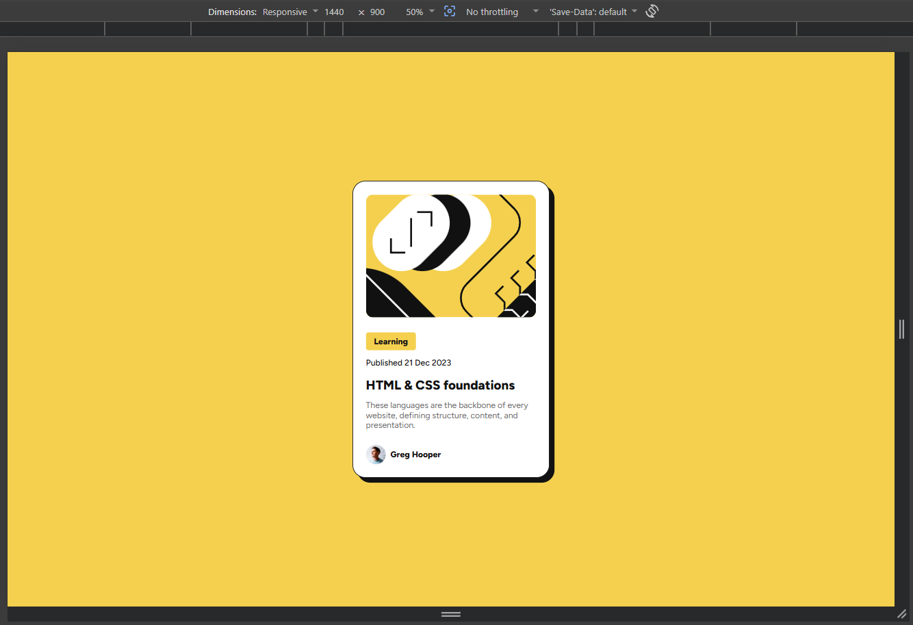
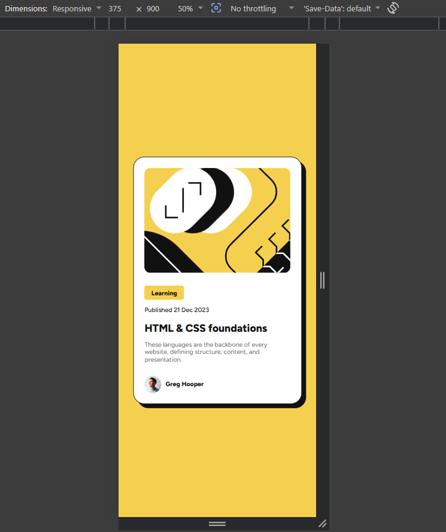

# Blog Preview Card
This is a solution to the [Blog preview card challenge on Frontend Mentor](https://www.frontendmentor.io/challenges/blog-preview-card-ckPaj01IcS).

## Table of Contents

- [Overview](#overview)
- [Screenshot](#screenshot)
- [Links](#links)
- [Built With](#built-with)
- [What I Learned](#what-i-learned)
- [Continued Development](#continued-development)
- [Author](#author)

## Overview

A clean and modern blog preview card component built with HTML and CSS. The design features a prominent article image, category tag, publication date, title, excerpt, and author information with a subtle shadow effect.

### Screenshot

**Desktop View**  

**Mobile View**  

## Links

- Live Site URL: [Vercel](https://blog-preview-card-sandy-five.vercel.app/)
- Solution URL: [Github](https://github.com/vo1d-bot/Blog-preview-card.git)

## Built With

- **Semantic HTML5**
- **CSS3** (Custom properties, Flexbox, Clamp for fluid typography)
- **Mobile-first** responsive design
- Google Fonts (Figtree)

## What I Learned

This project helped me strengthen my skills in:

- Using CSS custom properties (variables) for better maintainability
- Implementing fluid typography with `clamp()`
- Creating realistic card shadows and hover/focus interactions
- Improving semantic HTML structure and accessibility
- Working with Google Fonts and proper preconnect optimization

## Author

- GitHub - [vo1d-bot](https://github.com/vo1d-bot)
- Frontend Mentor - [vo1d-bot](https://www.frontendmentor.io/profile/vo1d-bot)

---

**Feedback & Suggestions Welcome!**  
Feel free to leave any feedback or suggestions to help me improve.
